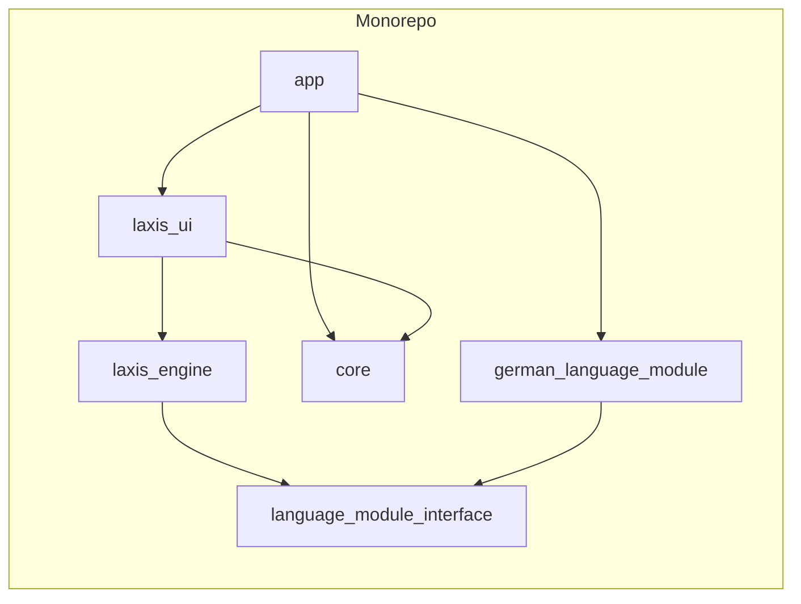

### **Introduction**

This document outlines the overall project architecture for Laxis, including backend systems, shared services, and non-UI specific concerns. Its primary goal is to serve as the guiding architectural blueprint for AI-driven development, ensuring consistency and adherence to chosen patterns and technologies.

**Relationship to Frontend Architecture:**
If the project includes a significant user interface, a separate Frontend Architecture Document will detail the frontend-specific design and MUST be used in conjunction with this document. Core technology stack choices documented herein (see "Tech Stack") are definitive for the entire project, including any frontend components.

#### **Starter Template or Existing Project**
N/A. This is a greenfield project that will be built from scratch. The project will follow a monorepo structure managed by `melos`, as detailed in the "Source Tree" section.

#### **Change Log**
| Date | Version | Description | Author |
|---|---|---|---|
| 2025-09-21 | 1.0 | Initial draft | BMad Master |

### **High Level Architecture**

#### **Technical Summary**
The Laxis architecture is designed as a modular monolith to support the long-term vision of a multi-language platform while allowing for rapid MVP development. The core principle is a strict separation of concerns between the stateless UI layer, the central `laxis_engine` for gameplay logic, and the interchangeable language modules. A `language_module_interface` acts as a contract, ensuring that the engine remains language-agnostic. This approach directly addresses the key non-functional requirements of modularity and scalability.

#### **High Level Overview**
The system is a modular monolith, built within a `melos`-managed monorepo. The user interacts with the `laxis_ui`, which is a stateless reflection of the application's state. All actions are processed by the `laxis_engine`. The engine, in turn, communicates with the current language module (e.g., `german_language_module`) through the `language_module_interface`. This ensures that the core gameplay logic is completely decoupled from any specific language's rules or content.

#### **High Level Project Diagram**
```mermaid
graph TD
    subgraph User
        direction TB
        UI_Layer[UI Layer]
    end

    subgraph Laxis App
        direction TB
        Laxis_Engine[Laxis Engine]
        Language_Abstraction_Layer[Language Abstraction Layer]
        German_Language_Module[German Language Module]
        Core_Services[Core Services]
    end

    UI_Layer --> Laxis_Engine
    Laxis_Engine --> Language_Abstraction_Layer
    Language_Abstraction_Layer --> German_Language_Module
    Laxis_Engine --> Core_Services
    ### **Introduction**

This document outlines the overall project architecture for Laxis, including backend systems, shared services, and non-UI specific concerns. Its primary goal is to serve as the guiding architectural blueprint for AI-driven development, ensuring consistency and adherence to chosen patterns and technologies.

**Relationship to Frontend Architecture:**
If the project includes a significant user interface, a separate Frontend Architecture Document will detail the frontend-specific design and MUST be used in conjunction with this document. Core technology stack choices documented herein (see "Tech Stack") are definitive for the entire project, including any frontend components.

#### **Starter Template or Existing Project**
N/A. This is a greenfield project that will be built from scratch. The project will follow a monorepo structure managed by `melos`, as detailed in the "Source Tree" section.

#### **Change Log**
| Date | Version | Description | Author |
|---|---|---|---|
| 2025-09-21 | 1.0 | Initial draft | BMad Master |

### **High Level Architecture**

#### **Technical Summary**
The Laxis architecture is designed as a modular monolith to support the long-term vision of a multi-language platform while allowing for rapid MVP development. The core principle is a strict separation of concerns between the stateless UI layer, the central `laxis_engine` for gameplay logic, and the interchangeable language modules. A `language_module_interface` acts as a contract, ensuring that the engine remains language-agnostic. This approach directly addresses the key non-functional requirements of modularity and scalability.

#### **High Level Overview**
The system is a modular monolith, built within a `melos`-managed monorepo. The user interacts with the `laxis_ui`, which is a stateless reflection of the application's state. All actions are processed by the `laxis_engine`. The engine, in turn, communicates with the current language module (e.g., `german_language_module`) through the `language_module_interface`. This ensures that the core gameplay logic is completely decoupled from any specific language's rules or content.

#### **High Level Project Diagram**
```mermaid
graph TD
    subgraph User
        direction TB
        UI_Layer[UI Layer]
    end

    subgraph Laxis App
        direction TB
        Laxis_Engine[Laxis Engine]
        Language_Abstraction_Layer[Language Abstraction Layer]
        German_Language_Module[German Language Module]
        Core_Services[Core Services]
    end

    UI_Layer --> Laxis_Engine
    Laxis_Engine --> Language_Abstraction_Layer
    Language_Abstraction_Layer --> German_Language_Module
    Laxis_Engine --> Core_Services
    ### **Introduction**

This document outlines the overall project architecture for Laxis, including backend systems, shared services, and non-UI specific concerns. Its primary goal is to serve as the guiding architectural blueprint for AI-driven development, ensuring consistency and adherence to chosen patterns and technologies.

**Relationship to Frontend Architecture:**
If the project includes a significant user interface, a separate Frontend Architecture Document will detail the frontend-specific design and MUST be used in conjunction with this document. Core technology stack choices documented herein (see "Tech Stack") are definitive for the entire project, including any frontend components.

#### **Starter Template or Existing Project**
N/A. This is a greenfield project that will be built from scratch. The project will follow a monorepo structure managed by `melos`, as detailed in the "Source Tree" section.

#### **Change Log**
| Date | Version | Description | Author |
|---|---|---|---|
| 2025-09-21 | 1.0 | Initial draft | BMad Master |

### **High Level Architecture**

#### **Technical Summary**
The Laxis architecture is designed as a modular monolith to support the long-term vision of a multi-language platform while allowing for rapid MVP development. The core principle is a strict separation of concerns between the stateless UI layer, the central `laxis_engine` for gameplay logic, and the interchangeable language modules. A `language_module_interface` acts as a contract, ensuring that the engine remains language-agnostic. This approach directly addresses the key non-functional requirements of modularity and scalability.

#### **High Level Overview**
The system is a modular monolith, built within a `melos`-managed monorepo. The user interacts with the `laxis_ui`, which is a stateless reflection of the application's state. All actions are processed by the `laxis_engine`. The engine, in turn, communicates with the current language module (e.g., `german_language_module`) through the `language_module_interface`. This ensures that the core gameplay logic is completely decoupled from any specific language's rules or content.

#### **High Level Project Diagram**
```mermaid
graph TD
    subgraph User
        direction TB
        UI_Layer[UI Layer]
    end

    subgraph Laxis App
        direction TB
        Laxis_Engine[Laxis Engine]
        Language_Abstraction_Layer[Language Abstraction Layer]
        German_Language_Module[German Language Module]
        Core_Services[Core Services]
    end

    UI_Layer --> Laxis_Engine
    Laxis_Engine --> Language_Abstraction_Layer
    Language_Abstraction_Layer --> German_Language_Module
    Laxis_Engine --> Core_Services
    German_Language_Module --> Core_Services
```

#### **Architectural and Design Patterns**
*   **Modular Monolith:** The application is a single deployable unit, but with strict internal boundaries between modules.
*   **Dependency Injection:** Riverpod will be used to inject dependencies, such as providing the `GermanLanguageModule` as the implementation for the `LanguageModuleInterface`.
*   **Repository Pattern:** To be used for data access, abstracting data sources from the application logic.
*   **Stateless UI:** The UI layer will be stateless, reacting to state changes from the engine.

### **Tech Stack**

#### **Cloud Infrastructure**
- **Provider:** TBD
- **Key Services:** TBD
- **Deployment Regions:** TBD

#### **Technology Stack Table**
| Category | Technology | Version | Purpose | Rationale |
| :--- | :--- | :--- | :--- | :--- |
| State Management | Riverpod | TBD | State management and dependency injection | Compile-safe dependency injection, granular rebuilds for performance. |
| Local Persistence | Isar | TBD | Local database for user progress and card dictionary | Fast, typed, queryable, and offline-first. |
| Routing | go_router | TBD | URL-based routing for web and mobile | Official Flutter package, essential for web target, clear and testable navigation logic. |
| Dependency Injection | Riverpod / get_it | TBD | Dependency injection | Riverpod for UI-related state and dependencies, get_it for global services. |
| Drag & Drop | Flutter Native | N/A | Core gameplay mechanic | Powerful and performant enough without external dependencies. |
| Immutability | freezed | TBD | Immutable data models | Prevents accidental state mutation bugs. |

### **Data Models**

#### **User**
*   **Purpose:** Represents a user of the application.
*   **Key Attributes:**
    *   `id`: String - Unique identifier for the user.
    *   `name`: String - The user's name.
    *   `email`: String - The user's email address.
*   **Relationships:**
    *   Has one `Progress` object.

#### **Progress**
*   **Purpose:** Tracks a user's progress through the language modules.
*   **Key Attributes:**
    *   `userId`: String - The ID of the user this progress belongs to.
    *   `completedQuestIds`: List<String> - A list of IDs of completed quests.
    *   `unlockedConceptIds`: List<String> - A list of IDs of unlocked concepts.
*   **Relationships:**
    *   Belongs to one `User`.

#### **Quest**
*   **Purpose:** Represents a single puzzle or challenge for the user to solve.
*   **Key Attributes:**
    *   `id`: String - Unique identifier for the quest.
    *   `prompt`: String - The text prompt for the quest (e.g., "Translate: 'I am a student'").
    *   `solution`: List<String> - An ordered list of card IDs representing the correct solution.
    *   `conceptIds`: List<String> - A list of concept IDs taught or reinforced in this quest.
*   **Relationships:**
    *   Belongs to one `LanguageModule`.

#### **Card**
*   **Purpose:** Represents a single word or punctuation mark that can be used to construct sentences.
*   **Key Attributes:**
    *   `id`: String - Unique identifier for the card.
    *   `text`: String - The text displayed on the card.
    *   `conceptId`: String - The ID of the concept this card is associated with.
*   **Relationships:**
    *   Belongs to one `LanguageModule`.

#### **LanguageModule**
*   **Purpose:** Represents a complete language curriculum (e.g., German A1).
*   **Key Attributes:**
    *   `id`: String - Unique identifier for the language module (e.g., "german_a1").
    *   `name`: String - The display name of the language module (e.g., "German A1: Foundations").
    *   `quests`: List<Quest> - A list of all quests in this module.
    *   `concepts`: List<Concept> - A list of all concepts in this module.
*   **Relationships:**
    *   None.

#### **Concept**
*   **Purpose:** Represents a single grammatical concept or vocabulary item.
*   **Key Attributes:**
    *   `id`: String - Unique identifier for the concept (e.g., "dative_case").
    *   `name`: String - The display name of the concept (e.g., "Dative Case").
    *   `explanation`: String - A detailed explanation of the concept.
*   **Relationships:**
    *   Belongs to one `LanguageModule`.

### **Components**

#### **app**
*   **Responsibility:** The main Flutter app, ties everything together.
*   **Key Interfaces:** None. This is the main entry point of the application.
*   **Dependencies:** `laxis_ui`, `german_language_module`, `core`
*   **Technology Stack:** Flutter

#### **laxis_engine**
*   **Responsibility:** Core gameplay logic.
*   **Key Interfaces:** Provides the application state to the UI layer.
*   **Dependencies:** `language_module_interface`
*   **Technology Stack:** Dart

#### **laxis_ui**
*   **Responsibility:** All reusable UI widgets.
*   **Key Interfaces:** Renders the UI based on the state from the `laxis_engine`.
*   **Dependencies:** `laxis_engine` (for models), `core`
*   **Technology Stack:** Flutter

#### **language_module_interface**
*   **Responsibility:** The contract (abstract classes/interfaces) for language modules.
*   **Key Interfaces:** Defines the interface that all language modules must implement.
*   **Dependencies:** None.
*   **Technology Stack:** Dart

#### **german_language_module**
*   **Responsibility:** Implementation of the `language_module_interface` for the German language. Contains all German-specific content and rules.
*   **Key Interfaces:** Implements the `language_module_interface`.
*   **Dependencies:** `language_module_interface`
*   **Technology Stack:** Flutter (for assets)

#### **core**
*   **Responsibility:** Shared utilities, data models, and services.
*   **Key Interfaces:** Provides shared functionality to other components.
*   **Dependencies:** None.
*   **Technology Stack:** Dart

#### **Component Diagrams**


### **Source Tree**
```
laxis-project/
├── melos.yaml                  # Melos configuration file
├── packages/
│   ├── app/                    # The main Flutter app, ties everything together
│   │   ├── lib/
│   │   └── pubspec.yaml        # Depends on: laxis_ui, german_language_module, etc.
│   │
│   ├── laxis_engine/           # Core gameplay logic (Dart only)
│   │   ├── lib/
│   │   └── pubspec.yaml        # Depends on: language_module_interface
│   │
│   ├── laxis_ui/               # All reusable UI widgets (Flutter package)
│   │   ├── lib/
│   │   └── pubspec.yaml        # Depends on: laxis_engine (for models), core
│   │
│   ├── language_module_interface/ # The contract (abstract classes/interfaces, Dart only)
│   │   ├── lib/
│   │   └── pubspec.yaml
│   │
│   ├── german_language_module/ # Implementation for German (Flutter package, for assets)
│   │   ├── assets/             # Contains german_a1.json, german_a2.json
│   │   ├── lib/
│   │   └── pubspec.yaml        # Depends on: language_module_interface
│   │
│   └── core/                   # Shared utilities, data models, services
│       ├── lib/
│       └── pubspec.yaml
│
└── pubspec.yaml                # Workspace root
```

### **Checklist Results Report**

(...)

### **Next Steps**

The architecture document is now complete. The next steps are:
1.  **Review with Product Owner:** The architecture document should be reviewed with the Product Owner to ensure it meets all requirements.
2.  **Begin Story Implementation:** The development team can now begin implementing the user stories, starting with Epic 1.
3.  **Set up Infrastructure:** The DevOps team can begin setting up the infrastructure, including the CI/CD pipeline.

#### **Architectural and Design Patterns**
*   **Modular Monolith:** The application is a single deployable unit, but with strict internal boundaries between modules.
*   **Dependency Injection:** Riverpod will be used to inject dependencies, such as providing the `GermanLanguageModule` as the implementation for the `LanguageModuleInterface`.
*   **Repository Pattern:** To be used for data access, abstracting data sources from the application logic.
*   **Stateless UI:** The UI layer will be stateless, reacting to state changes from the engine.

### **Tech Stack**

#### **Cloud Infrastructure**
- **Provider:** TBD
- **Key Services:** TBD
- **Deployment Regions:** TBD

#### **Technology Stack Table**
| Category | Technology | Version | Purpose | Rationale |
| :--- | :--- | :--- | :--- | :--- |
| State Management | Riverpod | TBD | State management and dependency injection | Compile-safe dependency injection, granular rebuilds for performance. |
| Local Persistence | Isar | TBD | Local database for user progress and card dictionary | Fast, typed, queryable, and offline-first. |
| Routing | go_router | TBD | URL-based routing for web and mobile | Official Flutter package, essential for web target, clear and testable navigation logic. |
| Dependency Injection | Riverpod / get_it | TBD | Dependency injection | Riverpod for UI-related state and dependencies, get_it for global services. |
| Drag & Drop | Flutter Native | N/A | Core gameplay mechanic | Powerful and performant enough without external dependencies. |
| Immutability | freezed | TBD | Immutable data models | Prevents accidental state mutation bugs. |

### **Data Models**

#### **User**
*   **Purpose:** Represents a user of the application.
*   **Key Attributes:**
    *   `id`: String - Unique identifier for the user.
    *   `name`: String - The user's name.
    *   `email`: String - The user's email address.
*   **Relationships:**
    *   Has one `Progress` object.

#### **Progress**
*   **Purpose:** Tracks a user's progress through the language modules.
*   **Key Attributes:**
    *   `userId`: String - The ID of the user this progress belongs to.
    *   `completedQuestIds`: List<String> - A list of IDs of completed quests.
    *   `unlockedConceptIds`: List<String> - A list of IDs of unlocked concepts.
*   **Relationships:**
    *   Belongs to one `User`.

#### **Quest**
*   **Purpose:** Represents a single puzzle or challenge for the user to solve.
*   **Key Attributes:**
    *   `id`: String - Unique identifier for the quest.
    *   `prompt`: String - The text prompt for the quest (e.g., "Translate: 'I am a student'").
    *   `solution`: List<String> - An ordered list of card IDs representing the correct solution.
    *   `conceptIds`: List<String> - A list of concept IDs taught or reinforced in this quest.
*   **Relationships:**
    *   Belongs to one `LanguageModule`.

#### **Card**
*   **Purpose:** Represents a single word or punctuation mark that can be used to construct sentences.
*   **Key Attributes:**
    *   `id`: String - Unique identifier for the card.
    *   `text`: String - The text displayed on the card.
    *   `conceptId`: String - The ID of the concept this card is associated with.
*   **Relationships:**
    *   Belongs to one `LanguageModule`.

#### **LanguageModule**
*   **Purpose:** Represents a complete language curriculum (e.g., German A1).
*   **Key Attributes:**
    *   `id`: String - Unique identifier for the language module (e.g., "german_a1").
    *   `name`: String - The display name of the language module (e.g., "German A1: Foundations").
    *   `quests`: List<Quest> - A list of all quests in this module.
    *   `concepts`: List<Concept> - A list of all concepts in this module.
*   **Relationships:**
    *   None.

#### **Concept**
*   **Purpose:** Represents a single grammatical concept or vocabulary item.
*   **Key Attributes:**
    *   `id`: String - Unique identifier for the concept (e.g., "dative_case").
    *   `name`: String - The display name of the concept (e.g., "Dative Case").
    *   `explanation`: String - A detailed explanation of the concept.
*   **Relationships:**
    *   Belongs to one `LanguageModule`.

### **Components**

#### **app**
*   **Responsibility:** The main Flutter app, ties everything together.
*   **Key Interfaces:** None. This is the main entry point of the application.
*   **Dependencies:** `laxis_ui`, `german_language_module`, `core`
*   **Technology Stack:** Flutter

#### **laxis_engine**
*   **Responsibility:** Core gameplay logic.
*   **Key Interfaces:** Provides the application state to the UI layer.
*   **Dependencies:** `language_module_interface`
*   **Technology Stack:** Dart

#### **laxis_ui**
*   **Responsibility:** All reusable UI widgets.
*   **Key Interfaces:** Renders the UI based on the state from the `laxis_engine`.
*   **Dependencies:** `laxis_engine` (for models), `core`
*   **Technology Stack:** Flutter

#### **language_module_interface**
*   **Responsibility:** The contract (abstract classes/interfaces) for language modules.
*   **Key Interfaces:** Defines the interface that all language modules must implement.
*   **Dependencies:** None.
*   **Technology Stack:** Dart

#### **german_language_module**
*   **Responsibility:** Implementation of the `language_module_interface` for the German language. Contains all German-specific content and rules.
*   **Key Interfaces:** Implements the `language_module_interface`.
*   **Dependencies:** `language_module_interface`
*   **Technology Stack:** Flutter (for assets)

#### **core**
*   **Responsibility:** Shared utilities, data models, and services.
*   **Key Interfaces:** Provides shared functionality to other components.
*   **Dependencies:** None.
*   **Technology Stack:** Dart

#### **Component Diagrams**


### **Source Tree**
```
laxis-project/
├── melos.yaml                  # Melos configuration file
├── packages/
│   ├── app/                    # The main Flutter app, ties everything together
│   │   ├── lib/
│   │   └── pubspec.yaml        # Depends on: laxis_ui, german_language_module, etc.
│   │
│   ├── laxis_engine/           # Core gameplay logic (Dart only)
│   │   ├── lib/
│   │   └── pubspec.yaml        # Depends on: language_module_interface
│   │
│   ├── laxis_ui/               # All reusable UI widgets (Flutter package)
│   │   ├── lib/
│   │   └── pubspec.yaml        # Depends on: laxis_engine (for models), core
│   │
│   ├── language_module_interface/ # The contract (abstract classes/interfaces, Dart only)
│   │   ├── lib/
│   │   └── pubspec.yaml
│   │
│   ├── german_language_module/ # Implementation for German (Flutter package, for assets)
│   │   ├── assets/             # Contains german_a1.json, german_a2.json
│   │   ├── lib/
│   │   └── pubspec.yaml        # Depends on: language_module_interface
│   │
│   └── core/                   # Shared utilities, data models, services
│       ├── lib/
│       └── pubspec.yaml
│
└── pubspec.yaml                # Workspace root
```

### **Checklist Results Report**

(...)
```

#### **Architectural and Design Patterns**
*   **Modular Monolith:** The application is a single deployable unit, but with strict internal boundaries between modules.
*   **Dependency Injection:** Riverpod will be used to inject dependencies, such as providing the `GermanLanguageModule` as the implementation for the `LanguageModuleInterface`.
*   **Repository Pattern:** To be used for data access, abstracting data sources from the application logic.
*   **Stateless UI:** The UI layer will be stateless, reacting to state changes from the engine.
